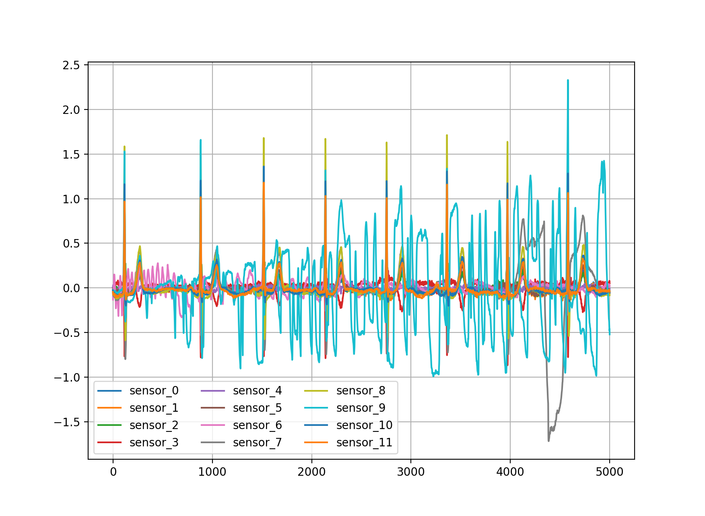

# ECG illness predict problem using Deep Neural Networks
## Short description
Automatic identification of the rhythm/morphology abnormalities in 12-lead ECGs. 
Original competition [link](http://2018.icbeb.org/Challenge.html)

Dataset contains age, gender and 12-lead ECG data of patients with or without illness.

ECG data example:

 
Label field classify all patients to 9 classes:

| Label  | Description  | 
| :---: | :--- |
| 1 | Normal |
| 2 | Atrial fibrillation (AF) |
| 3 | First-degree atrioventricular block (I-AVB) |
| 4 | Left bundle branch block (LBBB) |
| 5 | Right bundle branch block (RBBB) |
| 6 | Premature atrial contraction (PAC) |
| 7 | Premature ventricular contraction (PVC) |
| 8 | ST-segment depression (STD) |
| 9 | ST-segment elevated (STE) |

Target - predict illness "label" by rest columns from dataset.

## Hypotheses
Our aim is to check next hypotheses:
1) Main hypothesis that we able to predict illness by ecg data with ML algorithms and accuracy will be higher than 60%. 
2) We think that classical ML algorithms will be worse than Neural Nets
3) We suppose that Convolutional NN will be the most accurate model for this problem 

## Installation
To setup all dependencies just use:

`pip install -r requirements.txt`

## Train
To train you can download dataset from [here](https://drive.google.com/open?id=1Et6O5ihcFuPDXgnkTnUvuwTao0Pmayvq)

And start training by 

`python train.py --base_path=${YOUR_DATA_FOLDER_PATH}`

## Test
To test you can download needed model file from [here](https://drive.google.com/open?id=1aIyH4n2bxR1vX3d95IOmp5dsQOIeh9U2)

`python test.py --base_path=${YOUR_DATA_FOLDER_PATH} --type=${NEEDED_MODEL_TYPE} --model_path=${PATH_TO_MODEL_FILE}`

## Model scores and performance
Networks were tested with 2500 slice size and 40 augmentation multiplier. 
Test size was 30% of augmented dataset.

All networks learn for 20 epochs. After that I tried to get 
best checkpoint and write result of them.

To measure full dataset accuracy were generated 1 slice with 2500 
length with another random_state and batch_size = 1.

Inference time was measured at GTX 1060 6GB and i5-2550k 4.4 GHz hardware.

You can download TensorBoard files of NN learning process and model weights files [here](https://drive.google.com/open?id=1aIyH4n2bxR1vX3d95IOmp5dsQOIeh9U2) 
OR you can just view TensorBoard logs [here](https://tensorboard.dev/experiment/q55Ra1TkSxy0XH9gdg4fQw/)

SVM, RF, XGBoost were tested without augmentation. 

_a suffix mean that network uses avg pooling instead of max.

| Model  | Train accuracy  |  Test accuracy  | Full dataset accuracy  | F1 competition metric | Faf | Fblock | Fpc | Fst | Inference time (ms / record) |
|:------:|:---------------:|:---------------:|:----------------------:|:---------------------:|:---:|:------:|:---:|:---:|:------------------------------------:|
|CNN   | 95% | 65% | 84% | 0.809 | 0.758 | 0.889 | 0.713 | 0.807 | 2.609 |
|CNN_a   |  95% | 65%  |  88% | 0.857 | 0.876 | 0.908 | 0.794 | 0.848 | <b> 2.529 </b> | 
|VGGLikeCNN   | 96%  | 66%  | 87%  | 0.856  | 0.883 | 0.883 | 0.817 | 0.861 | 3.011 |
|VGGLikeCNN_a   | 97%  | 66%  | 88%  | 0.858 | 0.891 | 0.901 |  0.808 | 0.856 | 2.987 |
|<b>VGG_11</b>   | <b>94%</b>  | <b>73%</b>  | <b>90% </b> | <b>0.883 </b> | <b> 0.903 </b> | <b> 0.927 </b> | <b> 0.820 </b> | <b> 0.889 </b> | 3.758 |   
|MLP   | 66%  | 56%  | 63%  | 0.563 | 0.598 | 0.708 | 0.422 | 0.557 | 1.925 | 
|SVM   | 61%   | 28%  | 51%  | 0.483 | 0.557 | 0.517 | 0.508 | 0.444 | 164.133
|RF | 98%  | 40% | 80% | 0.796 |  0.777 | 0.812 | 0.802 | 0.790 | 0.082 |
|Optimal RF| 98% | 42% | 81% |  0.807 |  0.783 | 0.820 | 0.805 | 0.806 |  0.122|  
|XGBoost   | 98%  | 45%  | 82%  | 0.807 | 0.783 | 0.841 | 0.795 | 0.808 |  2.657 |

## Conclusion
We proved that ML algorithms able to solve this problem with accuracy about 73%, also we were right that the most accurate 
result was demonstrated by Convolutional Neural Net. Also we made up comparative
table where you can see different types of accuracy, competition metrics and inference time for all tested models.
Now we going to improve params and architecture of this net
to increase accuracy of the model and reach new results.   